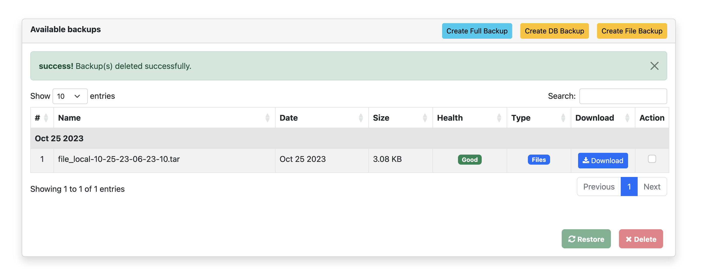
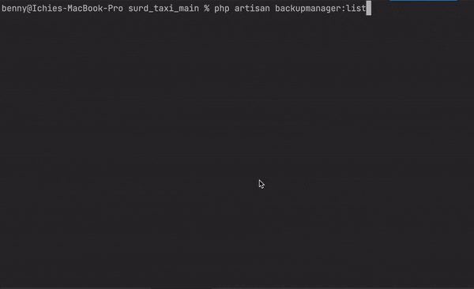
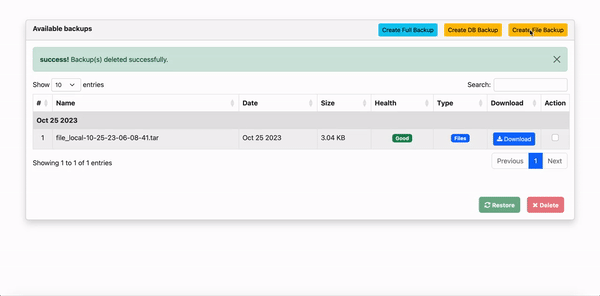

# Lara BackupManager

Lara-Backup-Manager is a versatile Laravel package designed to simplify the backup and restoration process for your Laravel applications. With support for various storage options defined in your filesystem.php configuration, it offers flexibility in managing your data backups. Additionally, this package goes a step further by allowing custom HTTP server integration for storage, making it a comprehensive solution for safeguarding your application's critical data. Whether you need to create routine backups or restore your data seamlessly, Lara-Backup-Manager provides an efficient and user-friendly solution for your Laravel projects.


## Screenshot






## Requirements

- PHP >= 7.3
- Laravel  6+
- `mysql` (to restore database)
- `mysqldump` (to backup database)
- `tar` (to backup/restore files)
- `zcat` (to extract database archive)

Please make sure above binaries are added to `PATH` environment variable or you can specify full path to them in config file.

## Installation

Via Composer

``` bash
$ composer require ichie-benjamin/lara-backup-manager
```

(Optional) Add Facade to `config/app.php` in `aliases` section:
```php
'BackupManager' => IchieBenjamin\LaraBackupManager\Facades\BackupManager::class,
```

---

Publish package's files by running below command:

```bash
$ php artisan vendor:publish --provider="IchieBenjamin\LaraBackupManager\ServiceProvider"
```
It should publish `config/lara-backup-manager.php` config file and migration file.

Run `php artisan migrate` to create backup verifier (`verifybackup`)) table.

---

Finally setup options in `config/lara-backup-manager.php` file and open the backup manager at url you have specified in `route` option eg `http//yourapp.com/lara-backup-manager`, you should now see interface of BackupManager.

See `config/lara-backup-manager.php` file for more information about backup settings.

## Setting Up Automatic Backups

To setup automatic backups, place following in `app/Console/Kernel.php` file:

```php
$schedule->command('backupmanager:create')->daily();
$schedule->command('backupmanager:create --only="db"')->everySixHours();
```

This package provides GUI interface to manage backups, also this following commands are also available:

```bash
  backupmanager:create                  Creates backup of files and/or database.
  backupmanager:create --only="db"      Creates backup of database only.
  backupmanager:create --only="files"   Creates backup of files only.
  backupmanager:list                    Shows list of backups taken.
  backupmanager:restore                 Restores a backup already taken.
```

## Saving Backups to Other Disks

By default this package saves backups to `local` disk but you can use built-in feature of laravel filesystem to save backups to other disks too. Let's say you want to upload to different server for which you have ftp credentials, you need to update those ftp credentials into laravel's `config/filesystems.php` file under `ftp` disk setting. Once you have done that, in backup manager config file (`config/backupmanager.php`) specify your disk to be `ftp` instead of `local` eg:

    // define disk options
    'disk' => 's3',

instead of

     'disk' => 'local',

Now backup files will be saved to s3 instead of locally.

## Disclaimer

This package is not affiliated with, maintained, authorized, endorsed or sponsored by Laravel or any of its affiliates.

## Security

If you discover any security related issues, please email [ichiebenjamin](mailto:ichiebenjaminchukwudi@gmail.com) instead of using the issue tracker.

## Credits

- [Ichie Benjamin][link-author]

## License

Please see the [license file](LICENSE.md) for more information.


[link-author]: https://github.com/ogbuechi
